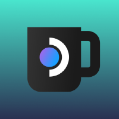
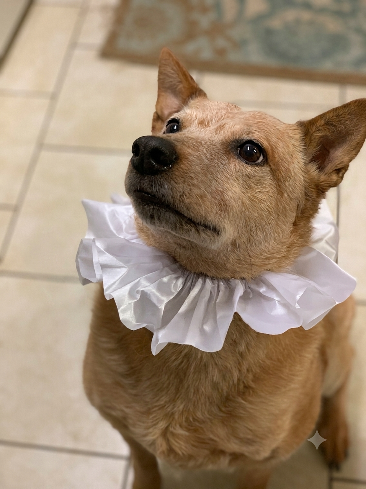

# Decky-StreamKoda

  

Decky Loader plugin for the Steam Deck's Big Picture / gamescope UI. For any
game that's **not installed locally but is installed on another of your
Steam machines**, it sets that other machine as the app's default streaming
target - so Steam's own native action button already shows/does "Stream"
instead of "Install", without needing to open the streaming-target dropdown
manually every time.

## Why

It's a minor gripe, but for games I want streamed by default, having to dig
into the dropdown every time is annoying enough that I'd rather Valve just
did this natively. Since they haven't, here's a plugin.

## Installation

1. Install [Decky Loader](https://decky.xyz/) if you haven't already.
2. Grab the latest release from this repo and sideload it via the Decky
   plugin store's "Install from ZIP" option (or drop it into
   `~/homebrew/plugins/` manually).

## In memory of Koda

This project was done in memory of my late dog Koda. He was my rock for 12
long years, and I wanted one of my first solo projects to be in memory of
him.

> May he forever be our rock, a distinguished gentleman.

  
  

## License

[BSD 3-Clause](LICENSE)
